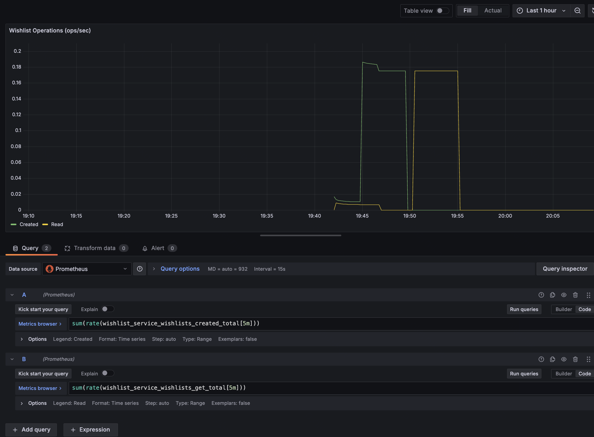
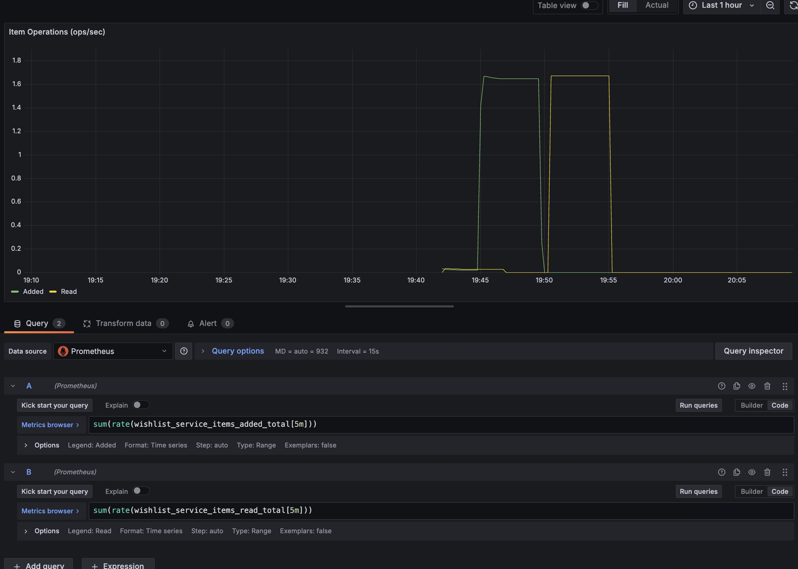
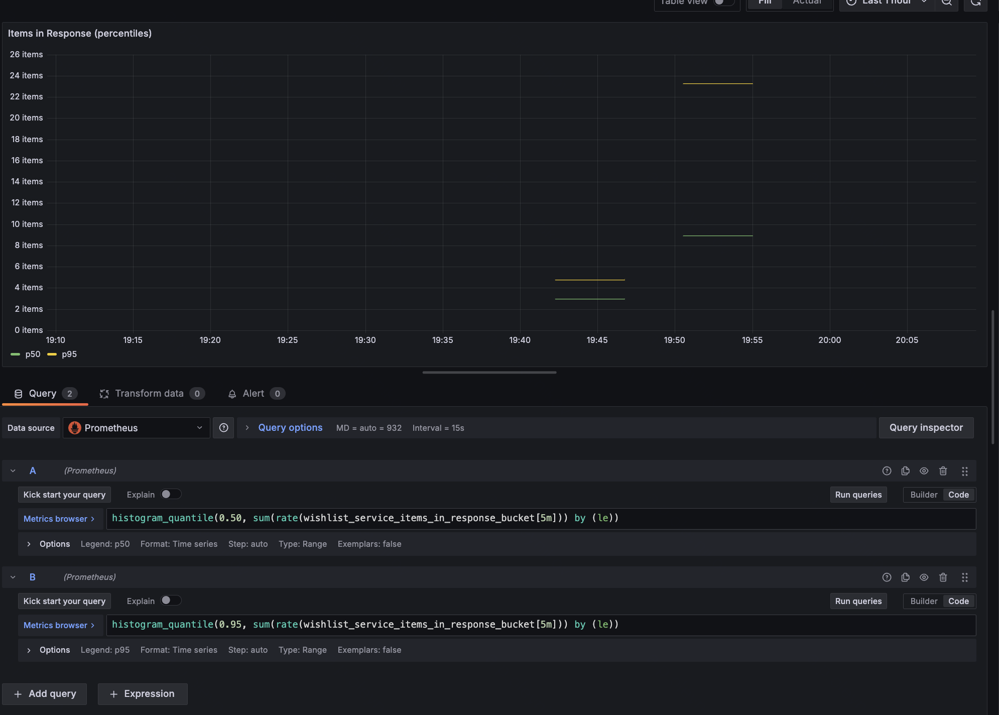
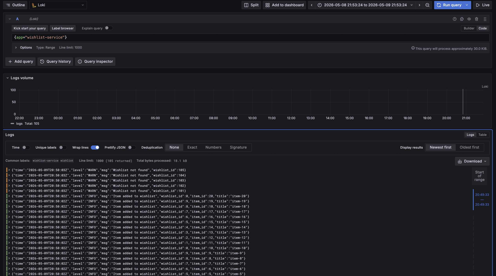
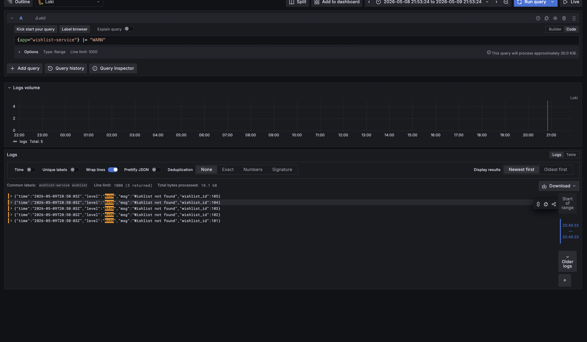
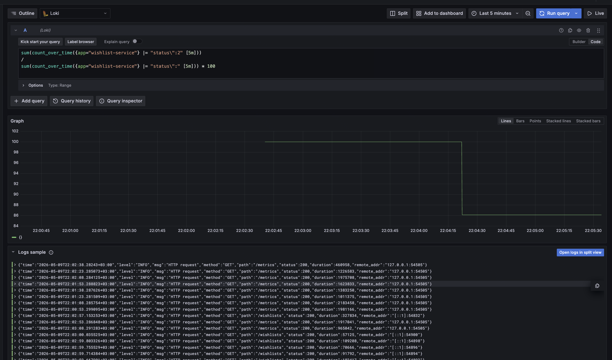
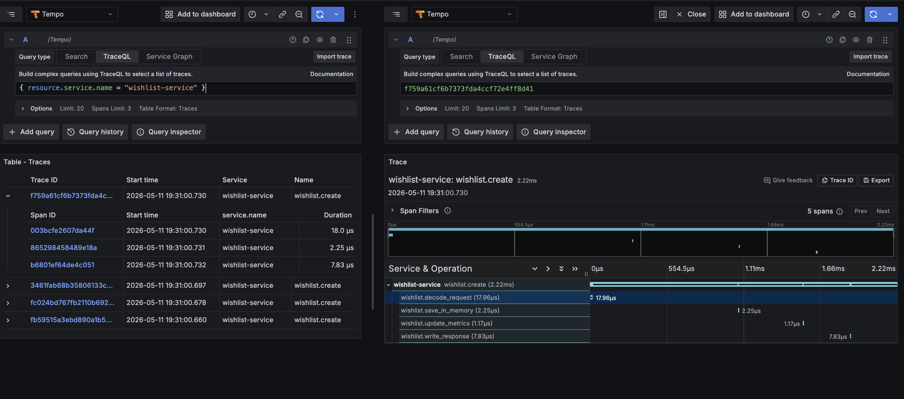
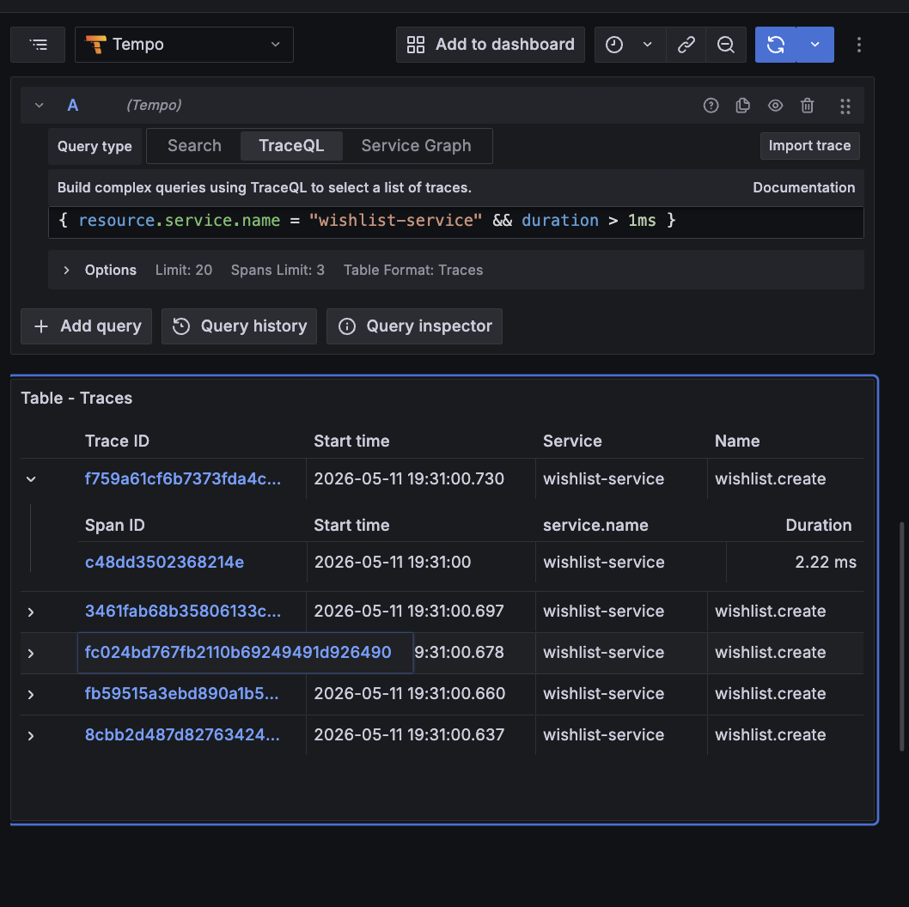

# Wishlist Service

## Описание

**Wishlist Service** – это REST API сервис для управления списками желаемых товаров.

Сервис позволяет пользователям:

- создавать вишлисты;
- просматривать список всех вишлистов;
- получать конкретный вишлист по идентификатору;
- удалять вишлисты;
- добавлять товары в вишлист;
- удалять товары из вишлиста.

## API Documentation

- [Swagger UI](https://ndreuu.github.io/ispro-wishlist/). Выполнение запросов возможно при запуске локального сервера.


## Сборка и запуск

```
go mod tidy
go run .
```

Сервер будет доступен по адресу:
```
http://localhost:8080
```

Swagger UI доступен по адресу:
```
http://localhost:8080/swagger/index.html
```

## Lab 3: Monitoring

Сервис предоставляет Prometheus метрики и Grafana dashboard для мониторинга.

### Metrics Endpoint
```
http://localhost:8080/metrics
```

### Бизнес-метрики (custom product metrics)
- `wishlist_service_wishlists_created_total` - количество созданных вишлистов
- `wishlist_service_wishlists_get_total` - количество операций чтения вишлистов
- `wishlist_service_items_added_total` - количество добавленных элементов
- `wishlist_service_items_read_total` - количество элементов, возвращённых в ответах
- `wishlist_service_items_in_response` - распределение количества элементов в ответах API

### Примеры PromQL запросов для Grafana
```promql
# Скорость создания вишлистов
sum(rate(wishlist_service_wishlists_created_total[5m]))

# Скорость чтения вишлистов
sum(rate(wishlist_service_wishlists_get_total[5m]))

# Количество добавленных элементов за час
sum(increase(wishlist_service_items_added_total[1h]))

# Количество прочитанных элементов за час
sum(increase(wishlist_service_items_read_total[1h]))

# 95-й перцентиль количества элементов в ответе
histogram_quantile(0.95, sum(rate(wishlist_service_items_in_response_bucket[5m])) by (le))
```





## Lab 4: Логирование и LogQL

Сервис предоставляет структурированное логирование с отправкой в Grafana Loki.

| Компонент | Версия | Назначение |
|-----------|--------|------------|
| **Go** | 1.21+ | Приложение (slog для логирования) |
| **Loki** | 2.9.8 | Хранилище логов |
| **Promtail** | 2.9.8 | Сбор и отправка логов в Loki |
| **Grafana** | 10.4.2 | Визуализация логов и метрик |
| **Prometheus** | 2.52.0 | Хранение метрик (для Lab 3) |
| **Docker Compose** | - | Оркестрация инфраструктуры |

### Типы логов
- HTTP запросы (method, path, status, duration, remote_addr)
- Бизнес-события (создание/чтение/удаление вишлистов и элементов)
- Ошибки (WARN уровень)

#### Все логи


#### Warn логи


#### Success Rate


## Lab 5: Trace

Сервис предоставляет distributed tracing с использованием OpenTelemetry и Grafana Tempo.

| Компонент          | Версия | Назначение                     |
| ------------------ | ------ | ------------------------------ |
| **OpenTelemetry**  | 1.43.0 | Создание и экспорт трейсов     |
| **Tempo**          | 2.4.0  | Хранилище трейсов              |

### Реализованные spans
- `wishlist.create` – root span создания wishlist
- `wishlist.decode_request` – декодирование JSON request body
- `wishlist.save_in_memory` – сохранение wishlist в memory storage
- `wishlist.update_metrics` – обновление Prometheus метрик
- `wishlist.write_response` – формирование HTTP response

### Все трейсы сервиса
`{ resource.service.name = "wishlist-service" }`


### Медленные трейсы
`{ resource.service.name = "wishlist-service" && duration > 1ms }`
